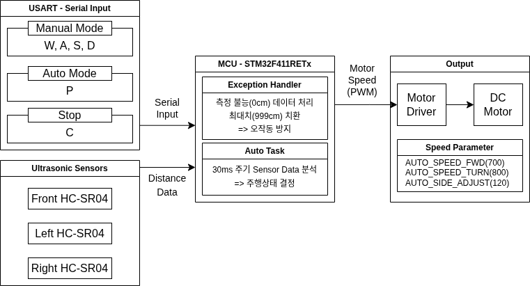

# 🚗 RC Car Control

> STM32F411RETx 기반 블루투스 수동 조종 + 초음파 3방향 자율 장애물 회피 RC카

<!--

-->

| Manual Mode | Auto Mode |
|:-----------:|:---------:|
|  |  |

---

## 1. Overview
 
| 항목 | 내용 |
|------|------|
| 플랫폼 | STM32F411RETx |
| 언어 | C |
| 도구 | STM32CubeIDE |
| 통신 | USART1 (HC-06 Bluetooth, 9600 bps) |
| 모터 제어 | L298N + TIM3 PWM |
| 거리 측정 | HC-SR04 × 3 (TIM2 Input Capture) |
| 개발 기간 | 2026.02.24 ~ 03.01 |
 
---
 
## 2. 주요 기능
 
- **블루투스 수동 조종**: 스마트폰 앱에서 W·A·S·D·C 명령으로 전후좌우 실시간 원격 제어
- **초음파 3방향 거리 측정**: 전방·좌·우 HC-SR04 센서를 라운드로빈으로 순차 트리거하여 간섭 없이 거리 산출
- **자율 장애물 회피 (Auto Mode)**: 30ms 주기로 3방향 거리를 분석해 직진·회전·정지를 자동 결정
- **측면 보정 (Side Adjust)**: 전방이 안전한 상황에서도 측면 10cm 미만 감지 시 보정 회전으로 벽 긁힘 방지
- **회전 유지 (Turn Hold)**: 회전 명령 후 220ms 동안 방향을 강제 유지해 충분한 회전 각도 확보
---
 
## 3. 시스템 아키텍처 및 핵심 구현
 
### Block Diagram
 

 
### 핵심 구현
 
**① 초음파 비동기 라운드로빈 측정**
 
3개 센서를 50ms 간격으로 순차 트리거하고, TIM2 Input Capture 인터럽트로 Rising→Falling 펄스 폭을 측정한다. 16비트 카운터 오버플로우는 `fall < rise` 조건으로 wrap-around 보정하며, `echoUs / 58`로 거리를 산출한다.
 
 
**② Auto Task 우선순위 상태머신**
 
0cm 예외처리 → Turn Hold → 직진 → 측면 보정 → 장애물 회피 순으로 30ms마다 주행 상태를 결정한다. 각 단계는 조건 충족 시 즉시 `return`하여 하위 단계로 내려가지 않는 우선순위 구조다.
 
 
---
 
## 4. 트러블슈팅
 
| 발생 문제 | 발생 원인 | 해결 방안 | 결과 |
|-----------|-----------|-----------|------|
| 넓은 공간에서 무한 정지 | 측정 범위 초과 시 0cm 반환 → 3면 막힘으로 오인식 | 0cm → 999cm 치환 예외 처리 추가 | 넓은 공간에서 정상 직진 주행 |
| 측면 벽면 긁힘 | 전방만 확인 후 무조건 직진, 사선 접근 시 벽 접촉 | Side Adjust 로직 추가 | 코스 이탈 없이 안정적 주행 |
| 회전 각도 부족으로 충돌 | 30ms마다 재판단으로 회전이 짧게 끊김 | Turn Hold 220ms 도입 | 충분한 회전 각도로 장애물 회피 성공 |
 
---
 
## 5. 디렉토리 구조
 
| 파일 | 역할 |
|------|------|
| `main.c` | 초기화, UART 콜백, 메인 루프 |
| `motor.c` | 모터 방향(GPIO) + 속도(PWM) 제어 |
| `ultrasonic.c` | HC-SR04 거리 측정 (Input Capture) |
| `auto.c` | 자율주행 상태머신 |
| `delay.c` | TIM11 기반 µs 딜레이 |
